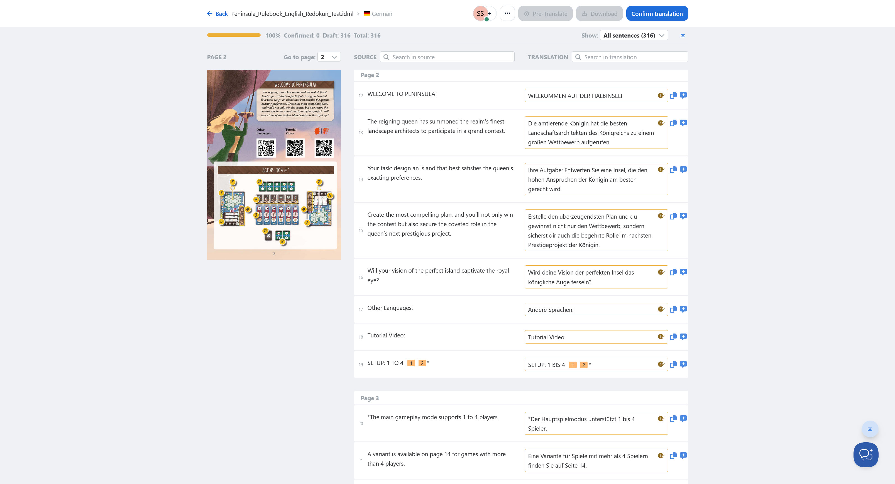
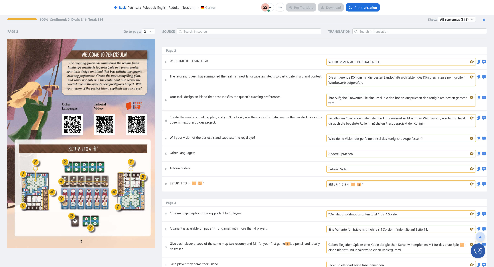

redokun-violentmonkey-userscript
=================================

Userscript to apply small improvements to the Translation Editor from [redokun.com](https://redokun.com/).

With this extension, the preview image of an IndesignFile displayed in the translation editor is more usable. If the browser window size is at least 1500px x 1024px, the whole width of the window is used, and the preview image is displayed twice the size.

How to install
--------------

You need a Userscript browser extension to run this:
* Alternative 1: [Violentmonkey](https://violentmonkey.github.io/) (open source)
* Alternative 2: [Tampermonkey](https://www.tampermonkey.net/)

We recommend to use Violentmonkey. However, as time of writing (March 2025), Violentmonkey is not running in latest Chrome versions. So, use Tampermonkey instead in that case.

After you installed this browser extension head to our user script:
[redokun.user.js](raw/refs/heads/main/redokun.user.js)

The Violentmonkey/Tampermonkey will detect it automatically und you can install it using the "install" button.

Now, login at [redokun.com](https://redokun.com/) and open the translation editor.

Preview
-------

Without Userscript:

With Userscript:

